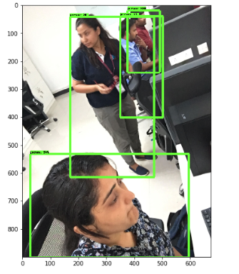

# object-detection

## Prerequisites

   - Follow the installation steps on [this link](https://tensorflow-object-detection-api-tutorial.readthedocs.io/en/latest/install.html).
You might need to change some versions of packages due to compatibility issues.
   - My output of "Conda list" command is something like this:
   
|Name |Version|Build|Channel|
|-----|-------|-----|-------|
_libgcc_mutex   |          0.1     |                   main  |     |
|absl-py           |        0.7.1      |              pypi_0  |  pypi|
|astor              |       0.8.0      |              pypi_0  |  pypi|
|attrs               |     19.1.0      |             py36_1  ||
|backcall             |     0.1.0      |              py36_0 | |
|blas                 |     1.0        |                 mkl ||
|bleach               |     3.1.0      |              py36_0 | |
|bzip2                |     1.0.7      |          h7b6447c_0 | |
|ca-certificates      |     2019.5.15  |                   0  |  anaconda|
|cairo                |     1.14.12    |          h8948797_3  ||
|certifi              |     2019.6.16  |              py36_0   | anaconda|
|click                |     7.0        |              py36_0   | anaconda|
|cloudpickle          |     1.2.1      |                py_0   | anaconda|
|cudatoolkit          |     10.1.168   |                   0 | |
|cudnn                |     7.6.0      |          cuda10.1_0 |   anaconda|
|cycler               |     0.10.0     |              pypi_0 |   pypi|
|cython               |     0.29.12    |              pypi_0 |   pypi|
|cytoolz              |     0.10.0     |      py36h7b6447c_0 |   anaconda|
|dask-core            |     2.1.0      |                py_0 |   anaconda|
|dbus                 |     1.13.6     |          h746ee38_0 | |
|decorator            |     4.4.0      |              py36_1 | |
|defusedxml           |     0.6.0      |                py_0 | |
|entrypoints          |     0.3        |              py36_0 | |
|expat                |     2.2.6      |          he6710b0_0  ||
|ffmpeg               |     4.0        |          hcdf2ecd_0  ||
|flask                |     1.1.1      |                py_0  |  anaconda|
|fontconfig           |     2.13.0     |          h9420a91_0 | |
|freeglut             |     3.0.0      |          hf484d3e_5 | |
|freetype             |     2.9.1      |          h8a8886c_1 | |
|gast                 |     0.2.2      |              pypi_0 |   pypi|
|glib                 |     2.56.2     |          hd408876_0 | |
|gmp                  |     6.1.2      |          h6c8ec71_1 | |
|graphite2            |     1.3.13     |          h23475e2_0 | |
|grpcio               |     1.22.0     |              pypi_0 |   pypi|
|gst-plugins-base     |     1.14.0     |          hbbd80ab_1 | |
|gstreamer            |     1.14.0     |          hb453b48_1 | |
|h5py                 |     2.9.0      |              pypi_0 |   pypi|
|harfbuzz             |     1.8.8      |          hffaf4a1_0 | |
|hdf5                 |     1.10.2     |          hba1933b_1 | |
|icu                  |     58.2       |          h9c2bf20_1 | |
|imageio              |     2.5.0      |              py36_0 |   anaconda|
|imutils              |     0.5.2      |              pypi_0  |  pypi|
|intel-openmp         |     2019.4     |                 243 | |
|ipykernel            |    5.1.1       |     py36h39e3cac_0 | |
|ipython              |    7.6.1       |     py36h39e3cac_0 | |
|ipython_genutils     |    0.2.0       |             py36_0 | |
|ipywidgets           |    7.4.2       |             py36_0 | |
|itsdangerous         |    1.1.0       |             py36_0 |   anaconda|
|jasper               |    2.0.14      |         h07fcdf6_1 | |
|jedi                 |     0.13.3     |              py36_0|  |
|jinja2               |     2.10.1     |              py36_0|  |
|jpeg                 |     9b         |          h024ee3a_2|  |
|jsonschema           |     3.0.1      |              py36_0|  |
|jupyter              |     1.0.0      |              py36_7|    anaconda|
|jupyter_client       |     5.2.4      |              py36_0|  |
|jupyter_console      |     6.0.0      |              py36_0|  |
|jupyter_core         |     4.5.0      |                py_0|  |
|keras-applications   |     1.0.8      |             pypi_0   | pypi|
|keras-preprocessing  |    1.1.0       |            pypi_0    |pypi|
|kiwisolver           |     1.1.0      |             pypi_0   | pypi|
|libedit              |     3.1.20181209 |         hc058e9b_0 | |
|libffi               |     3.2.1      |          hd88cf55_4 | |
|libgcc-ng            |     9.1.0      |          hdf63c60_0 | |
|libgfortran-ng       |     7.3.0      |          hdf63c60_0 | |
|libglu               |     9.0.0      |          hf484d3e_1 | |
|libopencv            |     3.4.2      |          hb342d67_1 | |
|libopus              |     1.3        |          h7b6447c_0 | |
|libpng               |     1.6.37     |          hbc83047_0 | |
|libprotobuf          |     3.8.0      |          hd408876_0 | |
|libsodium            |     1.0.16     |          h1bed415_0 | |
|libstdcxx-ng         |     9.1.0      |          hdf63c60_0 | |
|libtiff              |     4.0.10     |          h2733197_2 | |
|libuuid              |     1.0.3      |          h1bed415_2 | |
|libvpx               |     1.7.0      |          h439df22_0 | |
|libxcb               |     1.13       |          h1bed415_1 | |
|libxml2              |     2.9.9      |         hea5a465_1 | |
|libxslt              |     1.1.33     |          h7d1a2b0_0|  |
|lxml                 |     4.3.4      |      py36hefd8a0e_0|    anaconda|
|markdown             |     3.1.1      |              pypi_0|    pypi|
|markupsafe           |     1.1.1      |      py36h7b6447c_0|  |
|matplotlib           |     3.1.1      |             pypi_0 |  pypi|
|mistune              |    0.8.4       |    py36h7b6447c_0 | |
|mkl                  |     2019.4     |                 243| | 
|mkl_fft               |    1.0.12     |      py36ha843d7b_0 | |
|mkl_random           |     1.0.2      |      py36hd81dba3_0 | |
|mock                 |     3.0.5      |              py36_0 | |
|nbconvert            |     5.5.0      |                py_0 | |
|nbformat             |     4.4.0      |              py36_0 | |
|ncurses              |     6.1        |          he6710b0_1 | |
|networkx             |     2.3        |                py_0 |   anaconda|
|notebook             |     5.7.8      |              py36_0 | |
|numpy                |     1.16.4     |      py36h7e9f1db_0 | |
|numpy-base           |     1.16.4     |     py36hde5b4d6_0 | |
|object-detection     |     0.1        |              pypi_0|    pypi|
|olefile              |     0.46       |              py36_0 | |
|opencv               |     3.4.2      |      py36h6fd60c2_1 | |
|opencv-contrib-python|     4.1.0.25   |             pypi_0  |  pypi|
|openssl              |     1.1.1      |         h7b6447c_0  |  anaconda|
|pandoc               |     2.2.3.2    |                   0 | |
|pandocfilters        |     1.4.2      |              py36_1 | |
|parso                |     0.5.0      |                py_0 | |
|pcre                 |     8.43       |         he6710b0_0 | |
|pexpect              |     4.7.0      |              py36_0|  |
|pickleshare          |     0.7.5      |              py36_0|  |
|pillow               |     6.1.0      |              pypi_0|    pypi|
|pip                  |     19.1.1     |              py36_0|    anaconda|
|pixman               |     0.38.0     |          h7b6447c_0|  |
|pkg-config           |     0.29.2     |          h1bed415_8 | |
|pkgconfig            |     1.4.0      |              py36_0 |   anaconda|
|prometheus_client    |     0.7.1      |                py_0 | |
|prompt_toolkit       |     2.0.9      |              py36_0 | |
|protobuf             |     3.8.0      |              pypi_0 |  | pypi
|ptyprocess           |     0.6.0      |              py36_0 | |
|py-opencv            |     3.4.2      |      py36hb342d67_1  ||
|pygments             |     2.4.2      |                py_0 | |
|pyparsing            |     2.4.0      |              pypi_0 |   pypi|
|pyqt                 |     5.9.2      |      py36h05f1152_2 | |
|pyrsistent           |     0.14.11    |      py36h7b6447c_0 | |
|python               |     3.6.8      |          h0371630_0 | |
|python-dateutil      |     2.8.0      |              pypi_0 |   pypi|
|pytz                 |     2019.1     |                py_0 | |
|pywavelets           |     1.0.3      |     py36hdd07704_1  |  anaconda|
|pyzmq                |     18.0.0     |     py36he6710b0_0 | |
|qt                   |     5.9.7      |         h5867ecd_1 | |
|qtconsole            |     4.5.1      |               py_0 | |
|readline             |     7.0        |         h7b6447c_5 | |
|scikit-image         |     0.15.0     |      py36he6710b0_0|    anaconda|
|scipy                |     1.2.1      |      py36h7c811a0_0|    anaconda|
|send2trash           |     1.5.0      |              py36_0|  |
|setuptools           |     39.1.0     |              pypi_0|    pypi|
|sip                  |     4.19.8     |      py36hf484d3e_0|  |
|six                  |     1.12.0     |             pypi_0 |   pypi|
|sqlite               |     3.28.0     |         h7b6447c_0 | |
|tensorboard          |     1.12.2     |             pypi_0 |   pypi|
|tensorflow           |     1.12.0     |              pypi_0|    pypi|
|tensorflow-estimator |     1.13.0     |                py_0|  |
|tensorflow-gpu       |     1.9.0      |              pypi_0   | pypi|
|termcolor            |     1.1.0      |              pypi_0   | pypi|
|terminado            |     0.8.2      |             py36_0  ||
|testpath             |     0.4.2      |             py36_0  ||
|tk                   |     8.6.8      |          hbc83047_0  ||
|toolz                |     0.10.0     |                py_0   | anaconda|
|tornado              |     6.0.3      |      py36h7b6447c_0  ||
|traitlets            |     4.3.2      |              py36_0  ||
|wcwidth              |     0.1.7      |              py36_0  ||
|webencodings         |     0.5.1      |              py36_1  ||
|werkzeug             |    0.15.4      |               py_0    |anaconda|
|wheel                |     0.33.4     |              pypi_0   | pypi|
|widgetsnbextension   |     3.4.2      |              py36_0  ||
|xz                   |     5.2.4      |          h14c3975_4  ||
|zeromq                |    4.3.1      |          he6710b0_3  ||
|zlib                  |    1.2.11     |          h7b6447c_3  ||
|zstd                  |    1.3.7      |          h0b5b093_0 ||
## Run

   1. wifi_count.ipynb file is used to get image from other machine via client server socket and shows count of objects detected

      -To use it:
       -run wifi-client.ipynb 
       -run client.py in the pc where the remote web-camera is connected

   2. detect_video detection uses already existing camera on the pc to detect objects.
   3. detect_image file detects objects from the image
   
 ## Results
 
 
